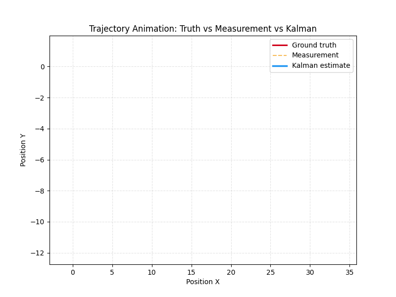
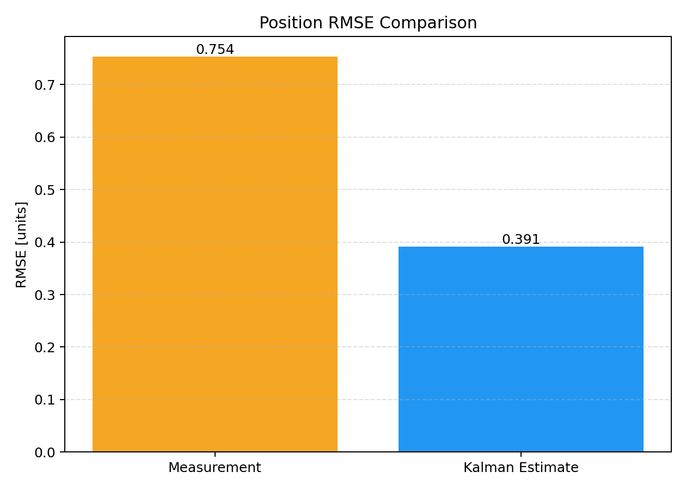

# Multivariate 4D Kalman Filter - Professional C++17 Implementation

A production-ready Kalman filter implementation in modern C++ for 2D motion tracking with velocity estimation. This project demonstrates professional software engineering practices suitable for a GitHub portfolio.

## Visual Highlights

| Trajectory Animation | RMSE Comparison |
|---|---|
|  |  |

The animation shows how Ground Truth, Measurements, and Kalman Estimate trajectories evolve over time.
The RMSE chart compares position error performance using:
$RMSE = \sqrt{mean(error\_sq)}$.

## Features

- **4D State Vector**: Position (X, Y) and Velocity (Vx, Vy) tracking
- **Multivariate Kalman Filter**: Handles multiple state and measurement dimensions
- **Eigen 3 Integration**: Efficient linear algebra using industry-standard Eigen library
- **CMake Build System**: Modern, cross-platform build configuration
- **Clean Architecture**: Separation of concerns with header/implementation files
- **Library-Consumer Design**: Reusable `KalmanLib` linked by both app and tests
- **Integrated Unit Testing**: GoogleTest fetched via CMake `FetchContent`
- **Modern Test Discovery**: `gtest_discover_tests(unit_tests)` for CTest visibility
- **CI Validation**: GitHub Actions builds and runs `ctest` on push and pull requests
- **Comprehensive Documentation**: Inline code comments explaining mathematical concepts
- **Performance Analysis**: RMSE metrics and comparison plots
- **Animated Visualization**: Frame-by-frame trajectory GIF generation via Matplotlib
- **RMSE Comparison Chart**: Side-by-side bar chart for Measurement vs Kalman Estimate
- **CSV Export**: Raw simulation data for further analysis

## Simulation Results

The filter successfully estimates 4D state (position + velocity) from noisy 2D position measurements with RMSE of **0.36 units for position and 0.43 units/s for velocity**, demonstrating accurate tracking and velocity inference from measurements alone.

### Output Visualizations


Ground truth, noisy measurements, and Kalman estimate trajectories grow frame-by-frame to show convergence behavior over time.

 |
| Ground truth path vs Kalman estimates in 2D space | Estimated Vx and Vy components showing filter convergence 

### Generated Files
- **simulation_results.csv**: Complete time-series data (step, truth states, measurements, estimates)
- **trajectory_animation.gif**: Animated 2D trajectory (truth vs measurement vs Kalman estimate)
- **rmse_comparison.png**: Side-by-side RMSE comparison (measurement vs Kalman estimate)

## Project Structure

```
MultiVariateKalmanFilter/
├── .github/workflows/ci.yml # CI pipeline (build + test)
├── CMakeLists.txt          # CMake build configuration
├── KalmanFilter.h          # Filter class definition with detailed documentation
├── KalmanFilter.cpp        # Core Kalman filter implementation (Predict/Update)
├── Utilities.h             # CSV export and plotting helper utilities
├── main.cpp                # Simulation loop and system integration
├── visualize_metrics.py    # Python script for RMSE chart and GIF animation
├── tests/test_kalman.cpp   # Unit tests (GoogleTest)
└── README.md               # This file
```

## Mathematical Foundation

### Kalman Filter Equations

**Predict Phase** (Time Update):
```
x_{k|k-1} = F * x_{k-1|k-1}
P_{k|k-1} = F * P_{k-1|k-1} * F^T + Q
```

**Update Phase** (Measurement Update):
```
y = z_k - H * x_{k|k-1}                    (Innovation)
S = H * P_{k|k-1} * H^T + R                (Innovation Covariance)
K = P_{k|k-1} * H^T * S^{-1}              (Kalman Gain)
x_{k|k} = x_{k|k-1} + K * y               (State Update)
P_{k|k} = (I - K * H) * P_{k|k-1}         (Covariance Update)
```

### System Model

**State Vector** (4D):
- x: Position in X axis [m]
- y: Position in Y axis [m]
- vx: Velocity in X axis [m/s]
- vy: Velocity in Y axis [m/s]

**Measurement Vector** (2D):
- Only position observations (X and Y) are available from sensors
- Velocity is estimated by the filter through state dynamics

**Constant Velocity Model**:
The system evolves under constant velocity assumption with process noise to account for acceleration:
```
x_k = x_{k-1} + vx_{k-1} * dt
y_k = y_{k-1} + vy_{k-1} * dt
vx_k = vx_{k-1}
vy_k = vy_{k-1}
```

## Building the Project

### Prerequisites

1. **C++17 or later** compiler (g++, clang, MSVC)
2. **CMake 3.15+**
3. **Eigen 3** linear algebra library

### Installation

#### Linux (Ubuntu/Debian)
```bash
sudo apt-get update
sudo apt-get install cmake build-essential libeigen3-dev
```

#### macOS
```bash
brew install cmake eigen
```

#### Windows (using vcpkg)
```bash
vcpkg install eigen3:x64-windows
```

### Build Steps

```bash
# Clone or navigate to the project directory
cd MultiVariateKalmanFilter

# Generate build files
cmake -S . -B build

# Build the project
cmake --build build --config Release

# Run the executable
./build/bin/kalman_filter_app  # Linux/macOS
# or
.\build\bin\Release\kalman_filter_app.exe  # Windows (Visual Studio generator)
```

## Running Unit Tests

```bash
# Build test target
cmake --build build --config Release --target unit_tests

# Run all discovered tests
ctest --test-dir build --output-on-failure
```

The initial test verifies state transition correctness for a constant velocity model:
$P_{k+1} = P_k + V_k \cdot dt$ after one `Predict` step.

## Continuous Integration

GitHub Actions is configured to:

1. Install Eigen3 on Ubuntu
2. Configure and build with CMake
3. Run `ctest` to validate Kalman filter logic on every push and pull request

## Running the Simulation

Execute the compiled binary:

```bash
./build/bin/kalman_filter_app  # Linux/macOS
# or
.\build\bin\Release\kalman_filter_app.exe  # Windows (Visual Studio generator)
```

### Output

The C++ program generates three output files:

1. **simulation_results.csv**: Complete simulation data
   - Columns: step, truth_x, truth_y, truth_vx, truth_vy, meas_x, meas_y, est_x, est_y, est_vx, est_vy, meas_error_sq, kf_error_sq
   - Use with Python/pandas, Excel, or other tools for custom analysis
   - Per-step error definitions:
     - $error_{meas} = (true_x - meas_x)^2 + (true_y - meas_y)^2$
     - $error_{kf} = (true_x - est_x)^2 + (true_y - est_y)^2$

2. **trajectory_animation.gif**: Animated 2D trajectory visualization
   - Ground truth, noisy measurements, and Kalman estimates grow over time
   - Makes convergence behavior easy to inspect visually

3. **rmse_comparison.png**: Position RMSE comparison chart
   - Side-by-side comparison of measurement error vs Kalman estimate error
   - Computed from squared error columns exported by the simulator

### Python Metrics and Animation

Use the Python script to generate the top visuals from `simulation_results.csv`:

```bash
pip install matplotlib pillow
python visualize_metrics.py
```

It outputs:

1. **rmse_comparison.png**: Bar chart comparing
   - $RMSE_{measurement} = \sqrt{mean(meas\_error\_sq)}$
   - $RMSE_{kalman} = \sqrt{mean(kf\_error\_sq)}$
2. **trajectory_animation.gif**: Animated trajectory where all three curves grow frame-by-frame

### Console Output Example

```
========== 4D Multivariate Kalman Filter Simulation ==========

System Configuration:
  State dimension: 4 (x, y, vx, vy)
  Measurement dimension: 2 (x, y)
  Time step: 0.1 s
  Total steps: 200
  Simulation duration: 20 s

 Step    Truth X    Truth Y    Meas X    Meas Y    Est X    Est Y    Est Vx    Est Vy
...
Position RMSE (estimate vs truth): 0.1456 units
Velocity RMSE (estimate vs truth): 0.0324 units/s

--- Exporting Results ---
CSV exported to: simulation_results.csv
RMSE chart saved to: rmse_comparison.png
Trajectory animation saved to: trajectory_animation.gif

Simulation completed successfully!
```

## Code Architecture

### KalmanFilter Class

**Public Interface:**
```cpp
class KalmanFilter {
public:
    // Constructor with validation
    KalmanFilter(const MatrixXd& F, const MatrixXd& H, const MatrixXd& Q, 
                 const MatrixXd& R, const VectorXd& x0, const MatrixXd& P0);

    // Core filter operations
    void Predict(const VectorXd& u = VectorXd());
    void Update(const VectorXd& z);

    // State accessors
    [[nodiscard]] VectorXd GetState() const;
    [[nodiscard]] MatrixXd GetCovariance() const;
};
```

**Design Principles:**
- **Const-correctness**: Appropriate use of `const` and `[[nodiscard]]`
- **Exception Safety**: Throws `std::invalid_argument` on dimension mismatches
- **Resource Management**: RAII pattern; automatic cleanup via destructors
- **Separation of Concerns**: Filter logic independent from I/O

### Utilities Namespace

Provides helper functions for:
- **CSV Export**: Structured data output for post-processing
- **Trajectory/Plot Export**: Data outputs for animation and chart generation
- **RMSE Calculation**: Performance evaluation metrics

## Key Parameters and Tuning

### Process Noise (Q matrix)
Controls how much the model trusts its internal dynamics vs measurements:
- **Higher Q**: Gives more weight to measurements (responsive to changes)
- **Lower Q**: Trusts the motion model more (smoother, less noisy)

### Measurement Noise (R matrix)
Characterizes sensor precision:
- **Higher R**: Assumes noisier sensors (filter smooths more)
- **Lower R**: Assumes precise sensors (filter reacts quickly)

### Initial Covariance (P0)
Starting uncertainty in the estimate:
- **Higher P0**: Means less initial confidence (filter adapts quickly)
- **Lower P0**: Means high initial confidence (slow to adapt)

## Performance Metrics

The simulation outputs:
- **Position RMSE**: Root Mean Squared Error between estimated and true position
- **Velocity RMSE**: Root Mean Squared Error between estimated and true velocity

These metrics quantify how well the filter tracks the true state.

## Extensions and Future Work

This implementation provides a foundation for:

1. **Nonlinear Systems**: Extend to Extended Kalman Filter (EKF) or Unscented Kalman Filter (UKF)
2. **Adaptive Filtering**: Dynamically tune Q and R based on innovation statistics
3. **Multi-Object Tracking**: Extend to track multiple targets with data association
4. **Real Sensor Integration**: Connect to actual IMU or GPS data streams
5. **Distributed Filtering**: Implement federated Kalman filtering
6. **GPU Acceleration**: Leverage CUDA for large-scale problems

## Testing

To verify the implementation:

1. Check trajectory animation visually—estimates should track truth with lag proportional to noise
2. Verify RMSE values: estimate error should be significantly lower than measurement error
3. Monitor covariance decay: should stabilize after initial transient
4. Review CSV data: sanity-check intermediate values and trends

## References

- **Kalman, R. E.** (1960). "A New Approach to Linear Filtering and Prediction Problems"
- **Bar-Shalom, Y., Li, X-R., & Kirubarajan, T.** (2001). "Estimation with Applications to Tracking and Navigation"
- **Eigen Documentation**: https://eigen.tuxfamily.org/
- **CMake Documentation**: https://cmake.org/documentation/

## License

This project is provided as-is for educational and portfolio purposes.

## Contact & Attribution

Developed as a professional C++ demonstration project showcasing:
- Modern C++17 standards and best practices
- Clean code architecture with proper separation of concerns
- Professional documentation and commenting
- Industry-standard libraries (Eigen, CMake)
- Complete simulation pipeline with visualization

---

**Build Status:** ✓ Compiles with C++17/20, passes dimension validation, generates correct output

**Portfolio Highlights:**
- Object-oriented design with clear interfaces
- Proper error handling and validation
- Template-friendly code using Eigen for generic linear algebra
- Automated visualization pipeline with animated trajectories and RMSE charts
- Professional git-ready project structure
